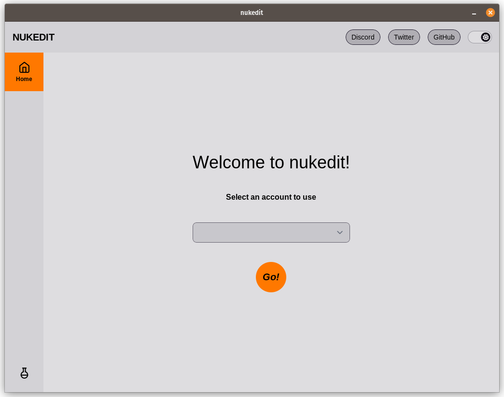
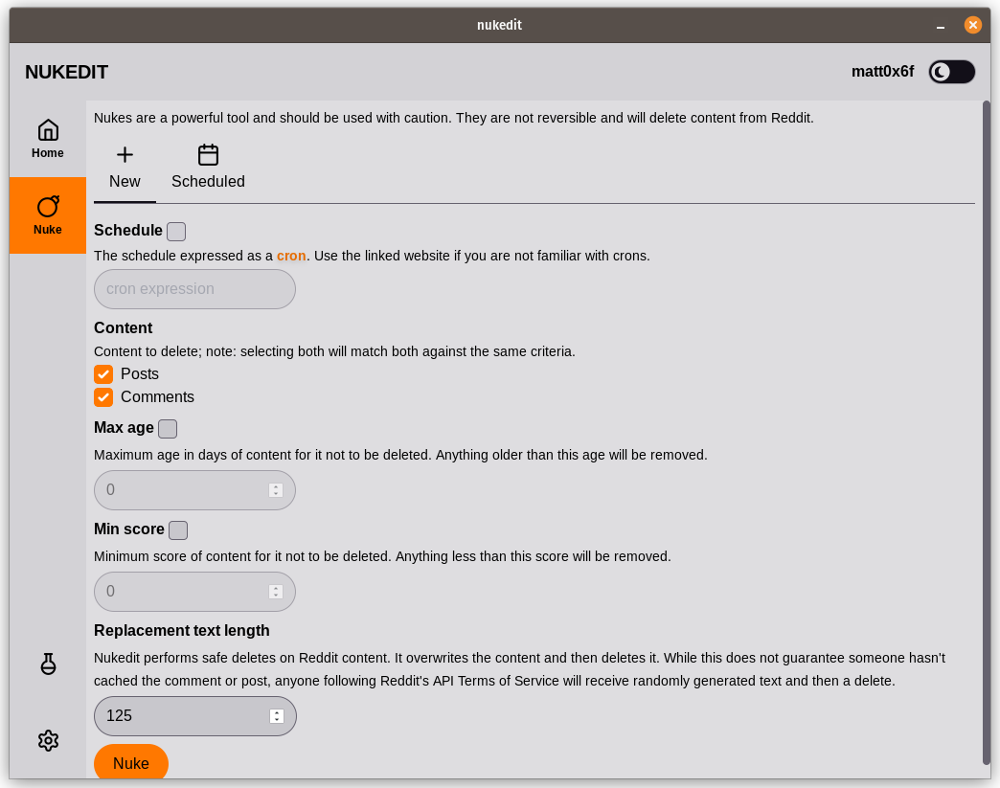

# README

## About

nukedit is a cross-platform desktop application for nuking Reddit post history. nukedit connects via Reddit's OAuth API to edit with randomly generated words and then delete posts. It does not talk to any external servers aside from Reddit.

nuked it supports multiple accounts

Posts and/or Comments can be deleted according to criteria

## Development

nuked it is written in Go and Typescript. It makes use of the following frameworks:

- [Wails](wails.io)
- [SvelteKit](https://kit.svelte.dev/)
- [Skeleton UI](https://www.skeleton.dev/)
- [TailwindCSS](https://tailwindcss.com/)

### Building

To build a redistributable, production mode package, use `wails build`.
